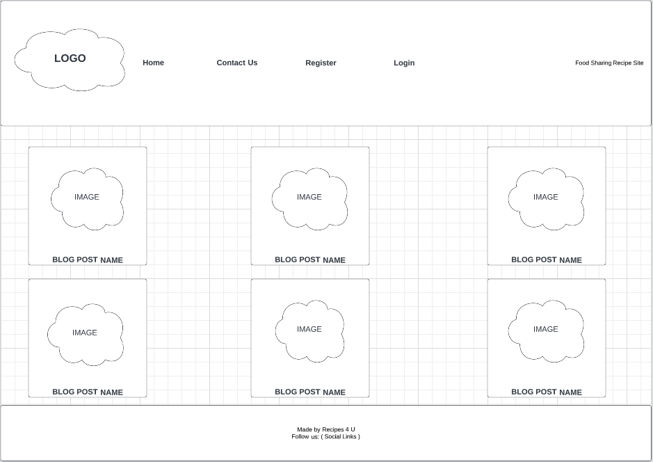
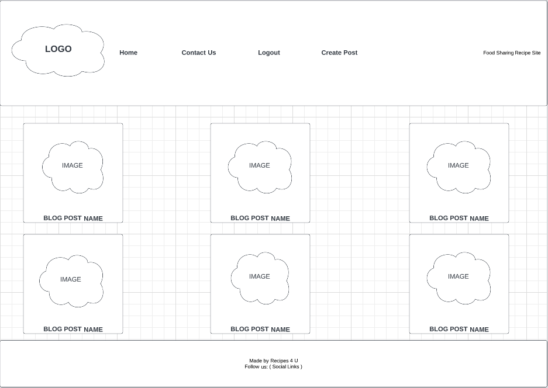
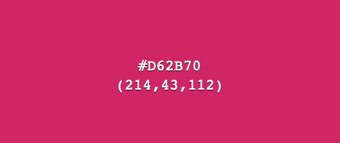
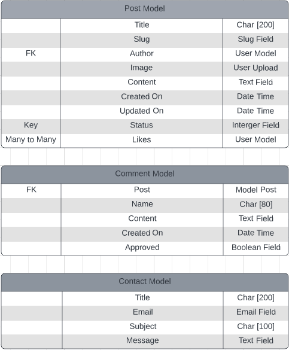

## Recipes 4 U ##
<br>

This Django project is a reccipe sharing blog intended for food lovers where users can upload, comment and like other recipes. Users can also view recipes posted by other users which they can try. Like a regular blog only registered users can post, comment on or like other recipies . Registered users will also have the ability to edit or remove their previous posts. 

## Post responsive images here

Link to site.

## UI/UX ##

The overall desing is kept simple as users are encouraged to post images to go with their recipes . Research has shown that people eat with their eyes so to speak so distractions were kep to a minium.

The layout of the site is standard for a blog site with clear descriptive navigational links. 

The site features are standard and expected for a blog site. 

**Agile**

The agile approach was employed in designing and constructing this project, from the outset of planning to the completion of development. To facilitate the process, I established a GitHub project and adopted the Kanban board methodology to divide project components into user stories and feasible tasks.

For a comprehensive view of all user stories please refer to the linked project [Project Kanban Board](https://github.com/users/oconnorian3/projects/10) . Additionally, each story has been assigned a label that indicates its level of significance in the site's overall functionality and acceptance.

## Wireframe

Below are some basic Wireframes done up before the project started.

*When a user is NOT logged in*



*When a user IS logged in*



## Development Planes ##

In order to develop an engaging and all-encompassing website, I conducted research on other food-related websites. This enabled me to identify and incorporate appropriate features and functionalities that aligned with my project, as well as determine a suitable color palette for the project.

## Strategy ##

**Site Goals**

The primary objective for the website was to establish a platform that users could effortlessly navigate and engage with, not only to upload their own recipes but also to interact with other members. My vision was to build a community where individuals could freely submit their favorite recipes and explore new ones.

The website caters to the following target groups:

* User Roles:
    * Standard User
    * Administrator

* Demographics:
    * Individuals passionate about food
    * Those seeking to broaden their culinary horizons
    * Cooking enthusiasts     

* The website must provide the user with the ability to:
    * Browse through recipes
    * Register and establish their account
    * Create and upload their own recipes
    * Like and comment on recipes
    * Fill out a contact form

* The website must provide the admin with the ability to:
    * Approve comments    
    * Filter through recipes, comments, and users to manage the site effectively    

## Scope ##

This section outlines the functions and features included in the project scope. The project was designed with minimal functionality in mind, which means that most of the features included are basic requirements. For instance, user sign up and login functionality had to be implemented, along with basic CRUD operations for authenticated users. For a detailed explanation of all the existing features, please refer to the Existing Features **Add Link** section. The Future Features section discusses potential features that were deemed unnecessary at this point in time, despite being within the project's possible scope.

## Structure ##

 The site's layout is based on a simple blog design that is commonly used by many other blogs online. With this structure, users can easily access the site, browse receipes , leave a message and login/register so they can upload their own recipes and comment on other recipes.

 ## Skeleton ##

 Wireframes were made using Lucid. Plsease click [here](#Wireframe) to view Wireframes. 

 ## Surface ##

 This pertains to the visual design aspect and how to effectively convey the desired emotions and effects. For a more comprehensive understanding of planning for the surface plane please see below.

**Colour Scheme**

A white background (#FFF) for all pages and posts was chosen throughout the site. A white background allows the images to standout which is the intention here. 

The colour (#d62b70) was used for most (not all) other areas of the site as this colour is the main colour used in the logo and using this colour throughout helps tie the design of the site in together. 



**Fonts**

Fill in later

**Images and Logos/Icons**

The custom logo was used using the Logo Generator Looka. The post imagery will be determined by whatever image the post creator decides to publish. A default image will be put in place should the user not upload an image. The social icons and comment/like icons are taken from Font Awesome.

## Features ##

**Navigation**

 * Navigation bar with logo and links
 * Different links visible for authenticated and unauthenticated users
 * Links change from **add colour** to **add colour** when you hover over them
 * Responsive menu which collapes into a burger on small to medium screens
 * Brief description on the far right, explaining what the site is about

**Add Imagery**

**Landing Page**

 * The landing page itself will immediately display the most recent ** posts.
 * The landing pagge will display both the headers and footer with easibly identifiable links to helo the user navigate throughout the site
 * Pagnation has been implekllented on the site so the user can scrool to the next set of posts using the "next" link
 * When a user is logged in the home page will display different links as seen in the images below

**Add Imagery**

**Post View For Non Logged In Users**

 * Recipe title and image viewble at the top of the post view page
 * Author's name and publish date viewable under title and image
 * Recipe content  
 * Number of likes and comments ( Non logged in users cannot contribute to this)
 * User can view approvded comments

**Add Imagery**

**Post View For Logged In Users**

 * Recipe title and image viewble at the top of the post view page
 * Author's name and publish date viewable under title and image
 * Recipe content
 * Number of likes and comments, user can click on the heart to add a like
 * Option to edit/remove a post if the user created that post. When clicking delete the user is prompted with the message *Are you sure you want to delete the following recipe?* which helps prevent users mistakinly deleteing posts.
 * Option to submit a comment and view other comments. Test must be added or else the comment will not submit.

**Add Imagery**

**Contact US**

 * This is a simple form which allows user contact the site admins directly. The form will not submit unless all fields are filled out. THer email field requires a valid email.

**Add Imagery**

**Register/Sign UP**

 * Allows user to create account
 * Fields include Username, Email (optional), Password and Password confirmation
 * Has an embeeded link which takes the user back to the login page should they need to

**Add Imagery**

**Login**

 * Login form asking for username and password of signed up user
 * Includes "Remember me" checkbox option
 * Has an embeeded link which takes the user back to the register page should they need to

**Add Imagery**

**Logout (For Authenticated Users Only)**

 * Seperate page prompts user to confirm action to sign out

**Add Imagery**

**Create Post (For Authenticated Users Only)**

 * Allows a user to create a post
 * Has a title , slug , and a body field. All fields must be filled out for the post to create. The body field allows users to format and style their text and also allows them to add images which will display in the body of the post only
 * User must select the author field and whether they just want a draft of the blog or actually publish it
 * User can submit an image aswell which will display as the main image for the post. If no image is selected a default place holder will be used

**Add Imagery**

**Edit Recpie (For Authenticated Users Only)**

 * Pre-populates all post content
 * User can update any field and change image
 * All fields are required and submission will not succeed unless form is completed

**Add Imagery**

**Delete Recipes (For Authenticated Users Only)**

 * Renders seperate page that prompts user to confirm action to delete recipe

**Add Imagery**

## Oppurtunities For Future Features ##

**Add Content**

## Database Models ##

I used Lucid to design the Database models. 



The Post & Content models are based on the Django tutorial walkthrough project by Code Institute. The project required one custom model (the contact model) . This model was desinged for the contact form. 

## CRUD ##

The project's design process was centered around the CRUD principle, which stands for Create, Read, Update, and Delete.

 * Create: An authenticated user can create and save a haiku entry.
 * Read: A user can browse and read their own and other users' haiku entries.
 * Update: An authenticated user can edit and update their own saved entries.
 * Delete: An authenticated user can delete their own saved entries.

## Technologies Used ##

**Main Languages Used**

 * HTML5
 * CSS3

**Hosting and Work**

 * Lucid (Wireframe and DB model Diagrams)
 * GitHub (Version Control)
 * GitPod (IDE)
 * Heroku (Hosting site)
 * Cloudinary (Some static Files)

**Python Libraries**

 * PyJWT (Python library that provides a way to encode and decode JSON Web Tokens (JWTs). JWT is a compact, URL-safe means of representing claims to be transferred between two parties. It can be used for authentication and authorization purposes in web applications )
 * Gunicorn (Python HTTP server for WSGI applications)
 * pyscopg2 (PostgreSQL Database adapter)

 **Django Libraries**

 * django-allauth (User authentication)
 * django-crispy-forms (Control rendering behaviour of Django forms)
 * Summernote (Summernote is a free and open-source WYSIWYG (What You See Is What You Get) text editor for web pages. It provides an easy-to-use interface for editing and formatting text, allowing users to create and publish rich content without having to write HTML code manually)
 * django-bootstrap4 (A third-party package for Django web framework that provides integration with the popular front-end framework Bootstrap 4. It allows developers to easily use Bootstrap's styling and components in their Django templates, without having to write the HTML and CSS code manually)

**Database**

 * ElephantSQL (PostgreSQL database hosting)

 ## Testing ##

 **Add content later**

 ## Deployment ##

 This project was deployed using Heroku, Cloudinary, ElephantSQL

 The following steps describe the required libraries to ensure successful deployment on Heroku.

 * Install Gunicorn (server used to run Django on Heroku): pip3 install django gunicorn
 * Install pyscopg2 (connects to PostgreSQL): pip 3 install dj_database_url pyscopg2
 * Install Cloudinary (host static files and images): pip3 install dj3-cloudinary-storage

**Creating the Heroku App**

 * Log into Heroku and go to the Dashboard
 * Click New and select Create new app from the drop-down
 * Name app appropriately and choose relevant region, then click Create App

**Create PostgreSQL database using ElephantSQL**

Creating a database accessible by Heroku is essential, as the database provided by Django cannot be accessed by a deployed Heroku app.


 * Log into ElephantSQL and go to Dashboard
 * Click Create New Instance
 * Set up a plan by providing a Name (project name) and select a Plan (for this project the free plan "Tiny Turtle" was chosen). Tags are optional.
 * Click Select Region and choose appropriate Data center
 * Click Review, check all details and click Create Instance
 * Return to Dashboard on click on the name of the newly created instance
 * Copy the database URL from the details section

**Update Settings**

 * Add the following code at the top of `settings.py` to connect Django project to env.py:

 ```
   import os
  import dj_database_url
  if os.path.isfile('env.py'):
      import env
 ```
 * Remove insecure secret key provide by Django in settings.py and refer to variable in env.py instead `(SECRET_KEY = os.environ.get('SECRET_KEY'))`
 * To connect to new database, replace provided DATABASE variable with

```
 DATABASES = {
    'default': dj_database_url.parse(os.environ.get("DATABASE_URL"))
}
```
* Save and migrate all changes made

**Connecting Heroku to Database**

* In Heroku dashboard, go to Settings tab
* Add three new config vars `DATABASE_URL (value is database URL)`, `SECRET_KEY (value is secret key string)` and `PORT (value "8000")`

**Connect to Cloudinary**

* In Cloudinary dashboard, copy API Environment variable
* In env.py file, add new variable `os.environ["CLOUDINARY_URL"] = "<copied_variable"` and remove `CLOUDINARY_URL=` from the variable string
* Add same variable value as new Heroku config var named `CLOUDINARY_URL`
* In settings.py, in `INSTALLED_APPS `list, above `django.contrib.staticfiles` add `cloudinary_storage`, below add cloudinary
* To define Cloudinary as static file storage add the following to settings.py

```
STATICFILES_STORAGE = 'cloudinary_storage.storage.StaticHashedCloudinaryStorage'
DEFAULT_FILE_STORAGE = 'cloudinary_storage.storage.MediaCloudinaryStorage'
```
**Allow Heroku as host**

 * In settings.py add

```
ALLOWED_HOSTS = ['app-name.herokuapp.com', 'localhost'
```

## Sources Credits ##

**Add Content**